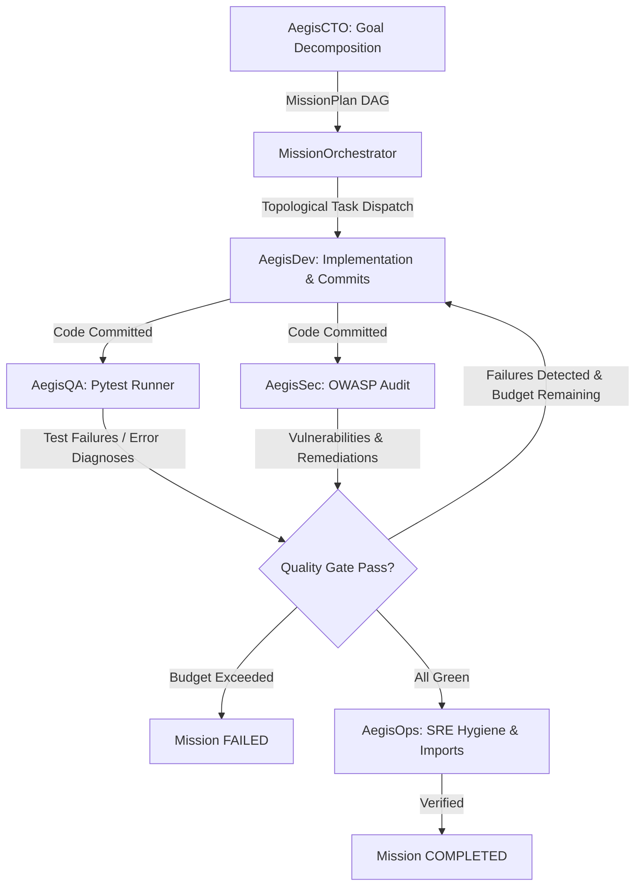

# AegisOS: Autonomous AI Engineering Organization

[](file:///tests/)
[](https://www.python.org/)
[](file:///ARCHITECTURE.md)
[](#license)

> **AegisOS** is an event-driven, state-governed autonomous multi-agent operating system designed to execute complex software engineering lifecycles.

Instead of naive infinite LLM loops with unconstrained bash execution, AegisOS enforces **deterministic state machine governance**, **strict sandboxed tool isolation**, and a **closed-loop feedback protocol** across five specialized engineering departments.

---

## 🏛️ System Architecture

AegisOS replaces linear agent pipelines with a **closed-loop feedback protocol**:

```
                         ┌──────────────────────────────────┐
                         │             AegisCTO             │
                         │  (Goal Decomposition -> MissionDAG)│
                         └─────────────────┬────────────────┘
                                           │ MissionDAG
                                           ▼
                         ┌──────────────────────────────────┐
                         │        MissionOrchestrator       │
                         └──────┬────────────────────▲──────┘
               Dispatch Task    │                    │ Feedback Loop
               in Topo Order    ▼                    │ (Failures / Vulnerabilities)
                         ┌──────────────┐            │
                         │   AegisDev   │            │
                         │ (Code/Commit)│            │
                         └──────┬───────┘            │
                                │ Changes Committed  │
                                ▼                    │
               ┌────────────────┴─────────────────┐  │
               ▼                                  ▼  │
        ┌──────────────┐                   ┌─────────┴────┐
        │   AegisQA    │                   │   AegisSec   │
        │ (Pytest Run) │                   │ (OWASP Audit)│
        └──────┬───────┘                   └─────────┬────┘
               │                                     │
               └───────────────┬─────────────────────┘
                               ▼
                        All Passed Green?
                        ├── NO  ──> Loop Back to AegisDev (bounded by max_repair_cycles)
                        └── YES ──> AegisOps (Health Check) ──> COMPLETED
```



---

## 👥 Autonomous Engineering Departments

Each department functions as an autonomous archetype with strictly enforced **Role-Based Access Control (RBAC)** at the tool registry level:

| Department | Role | Assigned Responsibilities | Registered Tools | RBAC Constraints |
|---|---|---|---|---|
| **AegisCTO** | Strategy & Architecture | Decomposes engineering goals into topological `MissionDAG` plans; identifies technical risks. | `ASTGrepTool`, `GitStatusTool`, `ReadFileTool` | **Strictly Read-Only**. Cannot write code, commit, or execute arbitrary shell commands. |
| **AegisDev** | Implementation | Authors code, refactors modules, executes AST-based symbol searches, and creates conventional Git commits. | `ReadFileTool`, `WriteFileTool`, `ListDirTool`, `ASTGrepTool`, `GitStatusTool`, `GitDiffTool`, `GitCommitTool`, `ExecuteCommandTool` | **Full Development Rights**. Cannot invoke QA test runners or deploy to production. |
| **AegisQA** | Verification | Programmatically executes pytest suites, diagnoses failure root causes, and authors test fixtures. | `PytestRunnerTool`, `ReadFileTool`, `ListDirTool`, `ASTGrepTool`, `WriteFileTool` (scoped to `tests/`) | **Tests-Scoped Writes**. Read-only over source code; write access restricted strictly to `tests/` directory. |
| **AegisSec** | Security & Compliance | Audits source files against the OWASP Top 10 checklist; identifies injection flaws, secrets, and unsafe execution. | `ReadFileTool`, `ListDirTool`, `ASTGrepTool` | **Strictly Read-Only**. Cannot modify files, execute shell commands, or commit changes. |
| **AegisOps** | SRE & Reliability | Conducts environment health checks, imports sanity validation, dependency conflict audits, and Git tree hygiene. | `ExecuteCommandTool`, `ReadFileTool`, `ListDirTool`, `GitStatusTool`, `GitDiffTool` | **Operational Shell Access**. Cannot write source files or author commits. |

---

## 🛡️ Security & Kernel Guarantees

1. **PathGuard Traversal Defense**: All filesystem operations resolve canonical absolute paths and block directory traversal attacks (`../`, symlink attacks, Windows alternate streams) outside the workspace root.
2. **Subprocess Isolation**: Shell and execution tools run under bounded execution quotas (`timeout_seconds`, memory bounds, max output truncation) with automated recursive process-tree termination.
3. **Zero-Crash Guarantee**: All tool invocations catch and wrap exceptions into structured `ToolResult.fail()` objects, preventing agent crashes.
4. **Deterministic State Machine**: LLMs choose intent; the deterministic `StateMachine` enforces step limits, stagnation guards (consecutive failure halting), role transition audits, and SQLite WAL point-in-time rollbacks.
5. **Bounded Feedback Loops**: Re-routing between verification (QA/Sec) and development (Dev) is capped by `max_repair_cycles = 3` to prevent runaway token expenditure.

---

## 🚀 Quickstart Guide

### Installation

```bash
# Clone the repository
git clone https://github.com/saicharan-r02/AegisOS.git
cd AegisOS

# Setup virtual environment
python -m venv .venv
source .venv/bin/activate  # On Windows: .\.venv\Scripts\Activate.ps1

# Install dependencies and AegisOS CLI
pip install -r requirements.txt
pip install -e .
```

### Environment Configuration

Configure your LLM credentials in `.env`:

```ini
# OpenAI
OPENAI_API_KEY=your-openai-key-here

# Groq (Optional)
GROQ_API_KEY=your-groq-key-here

# Ollama (Optional, Local)
OLLAMA_BASE_URL=http://localhost:11434
```

---

## 💻 CLI Usage

AegisOS includes an interactive terminal interface with real-time visual telemetry:

### 1. Execute an Autonomous Mission
```bash
aegis run "Build a resilient JWT authentication microservice with model validation and test coverage"
```
*Options:*
- `-w, --workspace <path>`: Target workspace root directory (default: `.`)
- `-p, --provider <name>`: LLM provider: `openai`, `groq`, or `ollama` (default: `openai`)
- `-m, --model <name>`: Model identifier (e.g. `gpt-4o`, `llama-3.3-70b-versatile`)
- `--max-repairs <int>`: Max closed-loop repair cycles (default: `3`)
- `--max-steps <int>`: Maximum total execution steps budget (default: `50`)

### 2. Standalone Security & Reliability Audit
Audit the current workspace without running a full mission:
```bash
aegis audit --target aegis_os/
```

### 3. Standalone QA Verification
Execute pytest runner and view structured failure diagnostics:
```bash
aegis test --target tests/
```

### 4. Inspect Mission Checkpoint History
```bash
# List all past mission sessions
aegis status

# Inspect full execution step trace for a session
aegis status <session_id>
```

### 5. Rollback to Prior Checkpoint
Revert workspace and mission state to an exact prior step snapshot:
```bash
aegis rollback <session_id> <step_index>
```

---

## 🐍 Programmatic Python API

You can embed AegisOS directly into your applications:

```python
from pathlib import Path
from aegis_os import MissionOrchestrator

orchestrator = MissionOrchestrator(
    workspace_root=Path("./workspace"),
    llm_provider="openai",
    llm_model="gpt-4o",
    max_repair_cycles=3,
)

summary = orchestrator.execute_mission(
    goal="Implement rate limiting middleware and verify with unit tests"
)

print(f"Mission Status: {summary.status.value}")
print(f"Tasks Executed: {summary.tasks_executed}")
print(f"Repair Cycles:  {summary.repair_cycles}")
```

---

## 🧪 Testing

The entire system is validated by an automated unit and integration test suite:

```bash
# Run all unit tests
pytest tests/unit/ -v

# Run entire test suite
pytest tests/ -q
```

---

## 📄 License

MIT License. See [LICENSE](LICENSE) for details.
